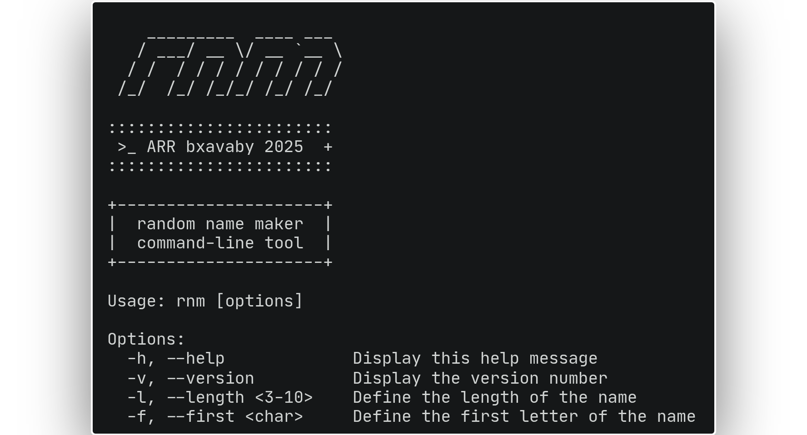

<div align="center">


───────────────────


[](https://github.com/bxavaby/rnm/commits/main)

# _random name maker_

### Generate random names in the command-line with ```rnm```

<br>



<br><br>

<div align="left">

## Install

Download the latest binary for your platform from [**Releases**](../../releases/latest) and add it to your PATH:

<br>

**Linux (x86_64):**
```
wget https://github.com/bxavaby/rnm/releases/latest/download/rnm-linux-x86_64
chmod +x rnm-linux-x86_64
sudo mv rnm-linux-x86_64 /usr/local/bin/rnm
```

**Linux (ARM64):**
```
wget https://github.com/bxavaby/rnm/releases/latest/download/rnm-linux-aarch64
chmod +x rnm-linux-aarch64
sudo mv rnm-linux-aarch64 /usr/local/bin/rnm
```

**macOS (Intel):**
```
curl -LO https://github.com/bxavaby/rnm/releases/latest/download/rnm-macos-x86_64
chmod +x rnm-macos-x86_64
sudo mv rnm-macos-x86_64 /usr/local/bin/rnm
```

**macOS (Apple Silicon):**
```
curl -LO https://github.com/bxavaby/rnm/releases/latest/download/rnm-macos-aarch64
chmod +x rnm-macos-aarch64
sudo mv rnm-macos-aarch64 /usr/local/bin/rnm
```

<br>

<details>
<summary><b>Build from source (alternative)</b></summary>

<br>

```
git clone https://github.com/bxavaby/rnm.git
cd rnm
zig build -Doptimize=ReleaseSmall
sudo mv zig-out/bin/rnm /usr/local/bin/
```

</details>

<br>

> ※ **Note:** If you are on Windows, download `rnm-windows-x86_64.exe` from [Releases](../../releases/latest) and add to your PATH.

<br>

## Usage

**Flags:**
- `-l` `<3–10>` _defines the length_ 
- `-f` `<char>` _defines the first letter_
- `-v` / `version` _prints the current version_ 
- `-h` / `help` _shows the help message_

<br>

<details>
<summary><b>Examples</b></summary>

<br>

```
$ rnm
favoda
```

```
$ rnm -l 4
pace
```

```
$ rnm -f l -l 4 && rnm -f e -l 5
losa
ezura
```

</details>

<br>

> ※ **Note:** `-l` and `-f` are order-independent but cannot be grouped (yet).

</div>

<br>

───────────────────

*First ziguana steps. Decided to make something moderately useful, while keeping it somewhat crude. Hence the logo.*

**[Report Bug](../../issues)** | **[Suggest Feature](../../issues)**

**MIT License © 2025 bxavaby**

</div>
